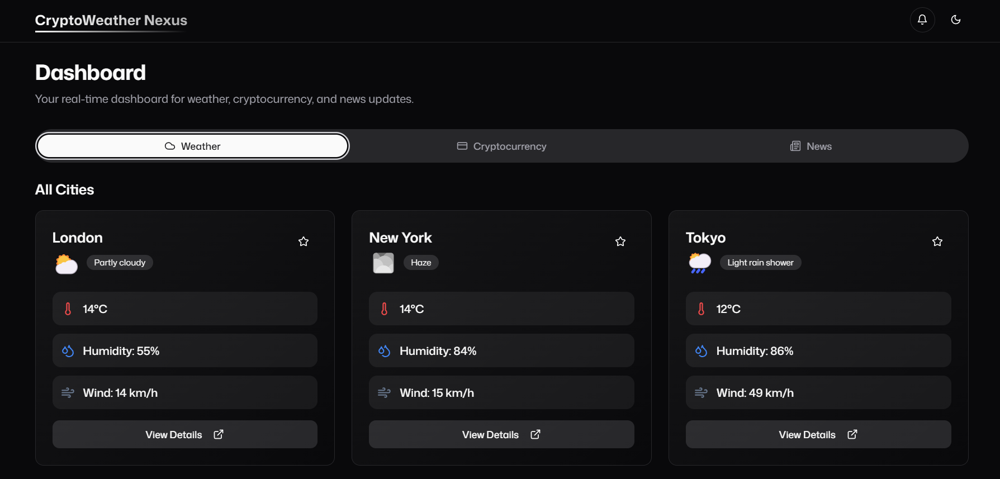
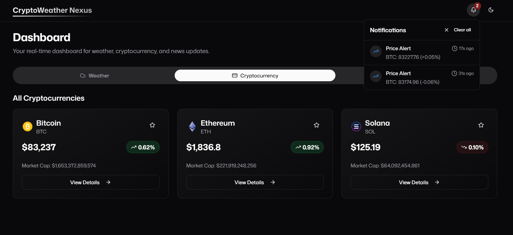
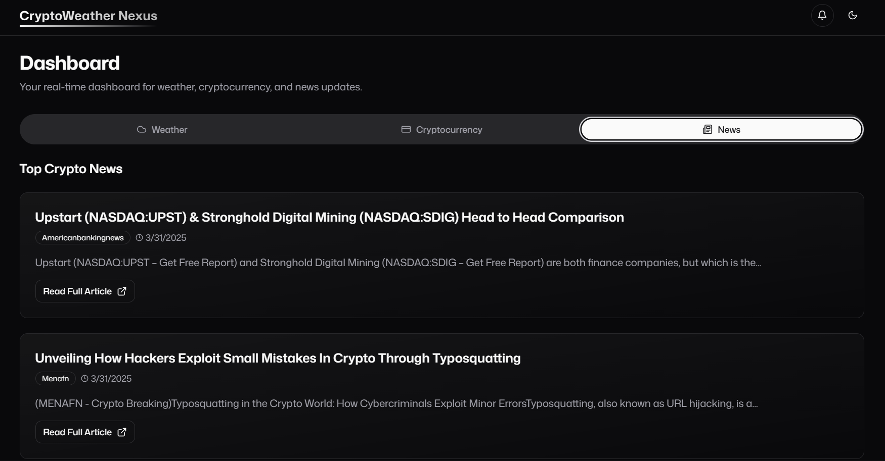

# _CryptoWeather Nexus_

## _Frontend Intern Assignment Submission - Userology_

_This project is my submission for the Frontend Intern position at Userology. CryptoWeather Nexus is a comprehensive dashboard application that provides real-time cryptocurrency data, weather information, and news updates in a sleek, user-friendly interface._

## 👤 About Me

- **Name:** Soham Datta
- **Email:** dattasoham805@gmail.com
- **Contact:** +91 9330089488
- **Website:** [https://www.sohamdatta.com](https://www.sohamdatta.com)

## 🚀 Live Demo

Check out the live application: [https://crypto-weather-nexus.vercel.app](https://crypto-weather-nexus.vercel.app/)

## ✨ Features

- **Cryptocurrency Dashboard**
  - Real-time price updates from CoinGecko API
  - Detailed cryptocurrency information and metrics
  - Historical price charts
  - Favorite cryptocurrency tracking

- **Weather Information**
  - Current weather conditions for multiple cities
  - Detailed weather metrics

- **News Feed**
  - Latest cryptocurrency and financial news
  - Article summaries and source attribution
  - External links to full articles

- **Real-time Notifications**
  - Price alerts for significant cryptocurrency movements
  - WebSocket integration for instant updates

## 🛠️ Technologies Used

- **Frontend Framework:** `NextJS` (App Router)
- **UI Components:** `shadcn/ui`
- **Styling:** `Tailwind CSS`
- **State Management:** `Redux Toolkit`
- **APIs:**
  - `CoinGecko API` for cryptocurrency data
  - `NewsData.io` for news articles
  - `CoinCap` WebSocket for real-time price alerts
  - `wttr.in` for weather data
- **Deployment:** Vercel

## _Screenshots_

